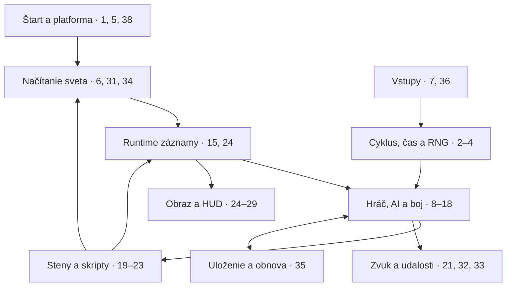

# Nitemare 3D — mapa otvorených oblastí celej hry

**Stav podkladov: 23. 9. 2026. Rozsah: DOS a Win16.**

Tento register rozdeľuje doterajších 12 širokých bodov na 40 pracovných okruhov. Počet 40 je organizačné rozdelenie, nie počet objavených chýb ani percento neznámeho kódu. Ide o priebežne aktualizovanú syntézu auditov; nové priame rozbory sú označené hashom buildu a adresami.

**Č = čiastočne analyzované:** existujú konkrétne zistenia, ale chýba úplné uzavretie. **B = bez doloženého úplného auditu:** v prečítaných podkladoch chýba systematické pokrytie celej oblasti; neznamená to, že nebola preskúmaná žiadna jej funkcia.

**P0:** bráni vernej rekonštrukcii alebo dôveryhodnému overeniu. **P1:** potrebné na dokončenie mechaník a obsahu. **P2:** doplnenie platformy, nástrojov a menej častých ciest. P2 zostáva súčasťou úplného pochopenia hry.

Výsledky konkrétneho Win16 buildu sa nesmú automaticky prenášať na DOS. Presné pôvodné názvy premenných spravidla nezískame; cieľom sú overené významy a správanie.

## A. Jadro, čas a správa dát

| # | Oblasť | Čo ešte chýba do detailného uzavretia | Stav | Priorita |
|---:|---|---|:---:|:---:|
| 1 | Štart a inicializácia | Argumenty, poradie nastavení a zariadení, všetky ukončovacie vetvy. | Č | P1 |
| 2 | Hlavný herný cyklus | Presné poradie vstup → AI → pohyb → zásah → render; pauza, menu a návrat do hry. | Č | P0 |
| 3 | Časovanie | Vzťah milisekúnd, simulačných krokov a DEMO čítača; kalibrácia, oneskorenie a LOAD. | Č | P0 |
| 4 | RNG a celočíselná matematika | Algoritmus, seed, násobenie, DEMO reset a modulo bias sú zmapované; zostáva úplné poradie odberov, resety mimo DEMO a celočíselné okraje. | Č | P0 |
| 5 | Pamäť a cache | Vlastníctvo alokácií, životnosť far pointerov, presuny a uvoľnenie dát, XMS/disk cache v DOS. | B | P1 |
| 6 | Načítanie levelu | Úplné poradie tvorby VEC/OBJECT/GUARD/door tabuliek, inicializácie a resetov; DOS hranice funkcií. | Č | P0 |

## B. Hráč a interakcie

| # | Oblasť | Čo ešte chýba do detailného uzavretia | Stav | Priorita |
|---:|---|---|:---:|:---:|
| 7 | Vstupné zariadenia | Zvyšné udalosti a kombinácie vstupov, myš, joystick dead-zone, strata fokusu a DOS/Win16 rozdiely. | Č | P1 |
| 8 | Pohyb a kolízia hráča | Presný polomer a rohy, kĺzanie popri stene, diagonály, obsadené bunky a pohyblivé prekážky. | Č | P0 |
| 9 | HP, smrť a obnova hry | Všetky zápisy HP, poradie zásahov, ochranné stavy, smrť a restart; hraničné hodnoty liečenia. | Č | P0 |
| 10 | Inventár a predmety | Všetky pickup vetvy, limity, spotreba a zachovanie kľúčov/kartičiek/metrov pri prechodoch. | Č | P1 |
| 11 | USE a špeciálne objekty | Vnútro zostávajúcich handlerov, trezory/kombinácie, truhly, rádio a špeciálne stanice. | Č | P1 |
| 12 | Teleportačné a výťahové cesty | Konečná poloha/smer, obsadený cieľ, dostupnosť poschodí, zrušenie výberu, triedy 0x25–0x2C. | Č | P1 |

## C. Nepriatelia a boj

| # | Oblasť | Čo ešte chýba do detailného uzavretia | Stav | Priorita |
|---:|---|---|:---:|:---:|
| 13 | GUARD AI a percepcia | Úplný graf pre každú triedu/stratégiu, priority, sluch a šírenie alarmu; okraje LOS a smerového testu. | Č | P0 |
| 14 | Bossovia a zvláštni aktéri | Transformácie, cannon/gargoyle vetvy, Dancers, GUARD25 a všetky príbehové podmienky. | Č | P0 |
| 15 | OBJECT a GUARD polia | Úplná mapa každého bajtu a bitu, všetci čitatelia/zapisovatelia, význam podľa triedy a životnosť. | Č | P0 |
| 16 | Zbrane, hitscan a damage | Výber cieľa, tolerancie zásahu, stav projekčnej cache pri damage, všetky kombinácie zbrane/triedy/obtiažnosti. | Č | P0 |
| 17 | Projektily | Zvyšné polia 42 B recordu, presná rýchlosť, všetky ukončenia letu, mapový pointer a DOS ekvivalent. | Č | P0 |
| 18 | Hazardy a kontakt | Dosah a podmienky ohňa, súbeh so zásahmi, blokovanie dverí aktérmi; potvrdiť prípadné poškodenie dverami. | Č | P1 |

## D. Steny, animácie a epizódy

| # | Oblasť | Čo ešte chýba do detailného uzavretia | Stav | Priorita |
|---:|---|---|:---:|:---:|
| 19 | Dvere, panely a pushes | Dosiahnuteľnosť všetkých stavov, smerové podmienky, blokovanie a reťazenie; stair-trap výnimka. | Č | P1 |
| 20 | Špeciálne steny | ONE_SHOT, SPECIAL1, REVWALL; presný DOS cleanup explodujúcej steny a všetky mapové varianty. | Č | P0 |
| 21 | SEQDEF a animačné udalosti | Skutočné intervaly a alternatívy jednotlivých assetov, koniec/loop, event/SFX väzby a šírka polí. | Č | P0 |
| 22 | Levelové skripty | Všetky TRIGGER1/2 vetvy a DAT_51A4–51AB: podmienka, zmena mapy, zvuk, reset a uloženie. | Č | P0 |
| 23 | Postup, finále a skóre | Úplná E3M10 cesta až po FLI/menu, restarty, skórové výnimky a vplyv obtiažnosti mimo známeho damage. | Č | P1 |

## E. Renderer a výsledný obraz

| # | Oblasť | Čo ešte chýba do detailného uzavretia | Stav | Priorita |
|---:|---|---|:---:|:---:|
| 24 | Geometria a VEC | VEC[1000], 28 B stride, štyri orientované zoznamy, spájanie hrán, owner buffer a span emitácia sú staticky zmapované. Zostávajú všetky flagy, invalidácia po zmene mapy a presná životnosť zoznamov naprieč buildmi. | Č | P0 |
| 25 | Projekcia, clipping a spany | Všetky orientačné prípady prekrytia, near-plane okraje, equality/tie správanie a presné fixed-point zaokrúhľovanie. | Č | P0 |
| 26 | Stenové texely a textúrový krok | Win16 wall cesta je staticky sledovaná `66B0 → EBD6/6422 → 3E44 → 366A/planar VGA`; U používa `base+U*0x40`, V sampling a clipping lookup tabuľky, WinG pitch `0x140` a planar pitch `0x50`; `8094` je shade remap a wall writer zapisuje nepriehľadný texel. V `MAP.1–3` sú závesové triedy `0x3F/0x40`; `0x3D/0x3E` sa v lookup tabuľkách nevyskytujú. | Č | P0 |
| 27 | Sprity a poradie kreslenia | Win16 100×18 B sloty sa kreslia v poradí slotov; per-column wall test číta `0x58FE`, VEC bit `0x10` ho obchádza a transparentný index je `0x29`. DOS vetva staticky ukazuje analogický test cez `0x47E4`, ale používa kľúč `0x1F`. | Č | P0 |
| 28 | Paleta a video výstup | WinG 320-byte pitch, planar VGA 80-byte pitch, shade lookup a wall/sprite pixelové vetvy sú staticky zmapované. Súbor `game.pal` je PCX 320×200 s vloženou paletou, nie overený surový `GAME.PAL`. | Č | P1 |

## F. Rozhranie, obsah a multimédiá

| # | Oblasť | Čo ešte chýba do detailného uzavretia | Stav | Priorita |
|---:|---|---|:---:|:---:|
| 29 | HUD a automapa | Každá položka a dirty flag, portréty a prahy, všetky značky/farby automapy a spotreba jej metrov. | Č | P1 |
| 30 | Menu, texty a konfigurácia | Celý reťazec príkazov/dialógov, uloženie nastavení, textové okraje a voliteľné úvodné obrazovky. | Č | P2 |
| 31 | MAP, IMG, UIF a grafické loadery | Runtime mutácie MAP, zvyšné IMG metadata a väzby frame/seqdef; UIF sloty 0–2 a význam prázdnych slotov. | Č | P1 |
| 32 | Zvuk a hudba | Vzorkový formát/frekvencia, event → SND ID, priority/prekrývanie, MIDI slučky a DOS/Win16 prehrávanie. | Č | P1 |
| 33 | ENDING.FLI | 488 deklarovaných verzus 489 fyzických blokov, prázdne konce, padding a presné správanie prehrávača. | Č | P2 |
| 34 | Pokrytie všetkých máp a assetov | Runtime správanie všetkých 31 blokov, anomália E2M4, hraničné počty aktérov a nepoužitý obsah. | Č | P1 |

## G. Uložený stav, systém a úplnosť analýzy

| # | Oblasť | Čo ešte chýba do detailného uzavretia | Stav | Priorita |
|---:|---|---|:---:|:---:|
| 35 | USER.SAV | 94 B hráčskeho bloku, každý príznak a timer, obnova pointerov a úplná kompatibilita medzi buildmi. | Č | P0 |
| 36 | DEMO | Mapa/spawn a runtime dĺžka; preklad rozdielnych DOS/Win16 recordov, úplná EOF/exit cesta a poradie RNG odberov po potvrdenom DEMO resete. | Č | P0 |
| 37 | Debug, CMD a cheaty | Aktivátory loggera v oboch platformách, skutočné argumenty, dosiahnuteľnosť diagnostických vetiev a rozsah cheat flagov. | Č | P2 |
| 38 | DOS a Win16 systémová vrstva | DOS prerušenia/ovládače, Win16 message loop a callbacky, API importy, MFC/runtime, obnova zariadení a cleanup. | B | P2 |
| 39 | Úplný register kódu a dát | Hranice funkcií, near/far/nepriame volania, jump tables, globály, konštanty, callbacky a kandidáti na dead code. | B | P0 |
| 40 | Verzie a overenie v pôvodnej hre | Presná identita buildov, rozdiely DOS/Win16/shareware/full, oprava rozporov a porovnávacie trasy stavov/obrazu/zvuku. | B | P0 |

## Mapa závislostí

Čísla odkazujú na tabuľku. Šípky vyjadrujú závislosti subsystémov pri analýze, nie úplný ani presný call graph EXE. Konfigurácia/menu, debug, register kódu a kontrola verzií sú priečne úlohy pre všetky vetvy.



## Čo už nemá byť vedené ako úplne neznáme

- MAP má rozlúštenú základnú hlavičku a dvojicu wall_id/object_id; údajný ďalší neznámy packed 16-bit bunkový formát bol chybný opis.
- Pre skúmaný Win16 sú potvrdené 28 B OBJECT a 26 B GUARD záznamy. Staršie 80/98 B odhady sú opravené.
- USER.SAV blok 0xC403 je 8 × 42 B projektilový pool; 4096 B blok je automapa, 256 B blok farebná remapa. Otvorené zostávajú vnútorné významy a okraje obnovy.
- Projektilové pohybové slová +00 až +0A už majú opis os/chyba/prírastky/znamienka. Hranica ±20 riadi volanie projekcie; nepreukazuje dosah ani zánik projektilu. +28 je vertikálny posun sprite-u, nie vek.
- DEMO má v oboch skúmaných platformách 6 B hlavičku a 8 B udalosti. Win16 používa byte kódu, word masky na +1, nekonzumovaný byte +3 a dword času. DOS používa word kódu, word masky na +2 a dword času; rozloženia nie sú priamo zameniteľné. Väčšina Win16 ovládacích bitov a význam hlavičkových krokov už sú opísané.
- Známe sú štyri Win16 cadence prahy [2,1,3,1] v krokoch, zásadné class/weapon damage úpravy a časť väzby damage na projekčnú cache. Otvorená je úplná validácia, poradie a DOS ekvivalent.
- Win16 VEC/span tok, wall texel writer, shade lookup, WinG/planar adresovanie a sprite transparency/occlusion vetvy sú staticky zmapované. Klasický DDA prototyp automaticky nedokazuje pixelovú zhodu s originálnym vector/span rendererom.
- Explodujúca stena má vo Win16 identifikovanú mapovú dokončovaciu cestu. Presná stopa a DOS call-target problém zostávajú otvorené.
- BSF má zdokumentovaný kontajner, hlavičku a textové bloky; kompletné hľadanie symbolov hry v ňom už nie je otvorenou úlohou.
- E1M3/E1M11 majú rovnaké wall ID, ale odlišných 17 object buniek; celkové binárne označenie „identické“ je nesprávne.

## Konkrétne neuzavreté polia a rozpory

| Položka | Presná ďalšia kontrola |
|---|---|
| GUARD +02..+05, +19 | Všetky čítania/zápisy; určiť aktívne pole, rezervu alebo len inicializačné dáta. |
| GUARD +0E | Podklady sa líšia medzi indexom definície a area ID; overiť indexovanie pri seqdef a pri budení guardov. |
| GUARD +12 | Neskorší rozbor podporuje invalidáciu smerovej cache hodnotou 8; starší názov pain timer je potrebné opraviť alebo verziovo vysvetliť. |
| Projectile +0D, +0F, +10, +15, +24..25, +29 | Dokončiť reader/writer maticu vrátane kopírovania šablóny a aliasovaných prístupov. |
| Projectile +1A..1D | Overiť životnosť mapového far pointeru počas letu a pri LOAD. |
| OBJECT +18 | Zmerať posledný zápis projekčnej cache voči okamihu zásahu a výpočtu damage. |
| Runtime seqdef interval | Podklady uvádzajú word aj dword pri +2/0x4746; šírku a prípadné prekrytie s pointerom +4 určiť z inštrukcií. |
| DAT_51A4–51AB | Každý bajt má rozpis readerov/writerov v samostatnej analýze story flags. Zostáva úplný príbehový význam, všetky MAP/SFX vetvy a správanie po LOAD. |
| 64 B wake tabuľka | Cache používa nenulový class-D wall selector a budí zodpovedajúcich guardov po úspešnej streľbe. Zostáva význam zoskupovania a rozsah selektorov medzi buildmi. |
| USER.SAV +2035, 94 B | Každé pole, znamienko, default, reset a rebase. |
| DEMO +3 | Skúmaný Win16 dispatcher ho nezapisuje ani nekonzumuje. V DOS je to horný bajt vstupnej masky; prípadné ďalšie buildy posudzovať samostatne. |
| DOS 1000:04BE | Pseudokód a raw cieľ completion callu si odporujú; opraviť segmentové mapovanie pred portom. |

## Zatiaľ nepotvrdené vlastnosti

Owner/friendly fire, zrýchlenie projektilu, splash damage, recoil, interpolácia dema či ďalšie skryté epizódy sa nesmú prezentovať ako existujúce neanalyzované systémy. Sú to otázky na potvrdenie prítomnosti alebo neprítomnosti. Podobne nulový priamy XREF sám nedokazuje nepoužitý kód: môže ísť o callback alebo nepriamy dispatch.

## Kedy bude okruh uzavretý

1. Je určený konkrétny vstupný build a jeho hash.
2. Sú správne hranice a prototypy funkcií; nepriame volania a dátové tabuľky majú vysvetlenie.
3. Každé relevantné pole má veľkosť, typ, inicializáciu, čitateľov, zapisovateľov a pravidlá resetu.
4. Každá vetva má podmienku, výsledok, timer, RNG a prípadný zvuk alebo zmenu mapy.
5. Statický výsledok súhlasí so stavom pôvodnej hry pri reprezentatívnych a hraničných vstupoch.
6. DOS/Win16 rozdiel je potvrdený alebo výslovne zostáva platformovo obmedzený.

Najsilnejšie poradie ďalšej práce: register funkcií a oprava DOS hraníc → hlavný cyklus/čas/RNG → field mapy → boj/AI/skripty → renderer a multimédiá → porovnávacie prehrávanie a save/load. Hlavný prínos je odstrániť závislosti, ktoré dnes bránia overeniu viacerých oblastí súčasne.

## Evidencia a rozsah záverov

Zdrojové dokumenty sú priebežné audity, ktoré obsahujú aj staršie rozpory. Opravy s konkrétnym dôkazom majú prednosť pred starými súhrnnými percentami. Samotný novší dátum nezaručuje správnosť interpretácie. V tomto registri sa nerozširuje dôkaz z jedného buildu automaticky na ostatné.

Prečítané a zosúladené podklady:

- Nitemare3D_unknowns_audit_2026-09-21.md, verzia 29, vrátane následných dodatkov.
- Nitemare3D_core_function_map_2026-09-23.md.
- Nitemare3D_projectile_pool_deep_map_2026-09-23.md, verzia 1.
- Nitemare3D_DEMO_playback_analysis_2026-09-23.md, verzia 2.
- Nitemare3D_12_areas_evidence_audit_2026-09-23.md.
- Kontextovo tiež už prečítané Nitemare3D_deep_unknowns_2026-09-23.md a Nitemare3D_unknown_logic_audit_2026-09-23.md.

Audit rozpoznáva 1 486 funkčných definícií a pomenovaný ručný súbor prvých 200 z každej platformy. Ďalších 1 086 bolo klasifikovaných podľa dôkazov; neskoršie cielené analýzy tento základ rozšírili. Preto 400 nie je aktuálny konečný počet všetkých preskúmaných funkcií a 1 486 nie je dôkaz úplne pochopenej hry. Bez aktualizovaného registra nie je možné vypočítať spoľahlivé percento celkového sémantického dokončenia.


## Druhý analytický prechod: výsledok ku všetkým 40 položkám

Tento prechod zosúlaďuje register s novšími priamymi auditmi Win16 1.10 a DOS v2.0. Hodnotenie sa vzťahuje na presne doložené časti; položka zostáva čiastočná, ak je otvorená čo len jedna dôležitá vetva. „Uzavretý výrez“ neznamená uzavretie celého subsystému. Bez živého porovnávacieho behu sa runtime časovanie a obrazová zhoda označujú ako otvorené.

| # | Výsledok analýzy a doložené fakty | Čo je naozaj otvorené a aký dôkaz to uzavrie |
|---:|---|---|
| 1 | **Štart – čiastočné.** Win16 má spoločnú stavbu `map.N`, `img.N`, `demo.N`; `-r` zapína záznam DEMO. Obe skúmané platformy obsahujú `Invalid command line`, ale samotný text neurčuje parser hry. | Zostaviť WinMain/DOS štartovaciu vetvu, zoradiť init grafiky, času, vstupu a súborov; nájsť všetky exit a chyby open/load. Rozlíšiť herné argumenty od runtime/MFC textov. |
| 2 | **DOS scheduler – poradie a DEMO vetvenie potvrdené.** `C1A8` oddeľuje vetvy 8/1000 a 25/1000 jednotiek zdrojového času. V bežnej hre volá `C150` pomalšia vetva; pri `3CD6 != 0` ho hlavná vetva volá pri nepárnom `4540`, pred inkrementom v `BF36`. | Úplná sémantika všetkých callee, zhodnosť Win16 poradia a živý trace. Vynechaný bucket zvyšuje logický čítač iba raz; scheduler spätne nedobieha všetky zmeškané kroky. |
| 3 | **DOS RTC handler a jednotky času potvrdené.** Skutočný vektor je `0BCC:0002`, teda image offset `BCC2`; ISR zvyšuje dword `DS:081E`, číta RTC C a posiela EOI obom PIC. Pri 1024 Hz RTC predstavujú vetvy 25/1000 a 8/1000 nominálne 25,6 a 8,192 Hz. `BDF8` poskytuje samostatný polling čas. | Zmerať skutočný beh, stratené IRQ, pauzu/LOAD a Win16 paritu. Samostatne preveriť wrap a čítanie čítača počas prerušenia. Hodnoty 40 a 65 sú jednotky `BE74`; 500 používa polling čas `BDF8`. |
| 4 | **RNG – algoritmus, násobenie, seed a DEMO reset potvrdené.** LCG `state × 214013 + 2531011 mod 2^32`, návrat `(state >> 16) & 0x7FFF`. DOS a Win16 používajú byte-identický 50 B násobiteľský helper. Obe DEMO štartovacie cesty nastavia seed 1. `3634/3636` sú countdown/fáza paletového záblesku. | Celkové poradie odberov, význam `3630/3632`, prípadné nepriame resety mimo DEMO a úplná save/load kontinuita RNG. Modulo bias je vypočítaný; runtime porovnanie zostáva otvorené. |
| 5 | **Pamäť a cache – otvorené.** Pevné kapacity polí sú potvrdené; USER.SAV obsahuje VEC/OBJECT/GUARD/door, panel, projectile, push, automap a remap bloky. | Chýba alokačno-vlastnícky graf, životnosť far pointerov po level change/LOAD a presná DOS XMS/disk-cache vetva. Treba sledovať alloc/free a všetky pointer rebasing writery. |
| 6 | **Level load – čiastočné.** MAP má 514-bajtovú hlavičku, dve 256-bajtové class mapy a 64×64 bunky po 2 B; finálne dáta obsahujú 31 levelov. Win16 staví názvy MAP/IMG/DEMO z rovnakého selektora. | Presné poradie parser → steny/vektory → objekty/guardy → dvere/panely/pushes → spawn; reset persistentných polí; DOS hranice `1000:84FE` a porovnanie level-init buildov. |
| 7 | **Vstupy – Win16 klávesnica prevažne zmapovaná.** Šípky menia `0x3756`; ľavý/pravý Shift nastavujú `0x40/0x20`, Ctrl `0x80`, Alt používa `0x3757`; Q prepína hudbu, R efekty, Alt+Enter režim okna. DOS číta aj klávesnicu, myš a joystick. | Neuzavreté sú Win16 myš/joystick, DOS scancode mapovanie, dead-zone, strata fokusu a kombinované udalosti. Raw caller test pre stavový bit `0x8000` a tri systémové klávesové callery. |
| 8 | **Pohyb/kolízia hráča – čiastočne potvrdené.** Svetové súradnice sa prevádzajú na dlaždice posunom o 6; hráčsky commit zapisuje X/Y a pri zmene bunky posiela event `0x16`. Známe sú tri helpery pred commitom. | Presný polomer/rohy, axis slide pri každej stene, diagonály, moving blockers a poradie helperov pri obsadených dverách. Rozobrať tri pre-commit helpery a otestovať hraničné súradnice v origináli. |
| 9 | **HP, smrť a obnova – čiastočné.** Guard damage podľa vzdialenosti/class, difficulty a damage writer/ death vetvy sú analyzované; existujú priame vetvy hráčskeho kontaktového damage. | Kompletná matica hráčskych HP writerov, invulnerability/stagger, smrť, respawn/restart a limity heal/pickup. Porovnať všetky zásahy v rovnakom ticku, najmä hazard + guard/projektil. |
| 10 | **Inventár – čiastočné.** Objektové triedy pokrývajú kľúče, karty, jedlo, zbrane a muníciu; sú známe viaceré ammo pooly a ich spotreba pri streľbe. | Limity, duplicitný pickup, spotrebovanie ID karty/kľúča, čo sa prenáša cez level/episode a čo sa mení pri difficulty/restart. Sledovať každý writer inventára aj save/load. |
| 11 | **USE – vysoké pokrytie, nie uzavreté.** Centrálna USE vetva, karty, secret panely, remote dvere `0x1E/0x1F`, väčšina warpov a bežných dverí sú doložené. | Zostávajú SAFE/TRUNK/radio/special station handlers, trezorové kombinácie a kombinácie class × map variant. Zostaviť callsite → class → runtime record → MAP write pre každú triedu. |
| 12 | **Teleporter/výťah – hlavné cesty potvrdené.** WARP rodiny a elevator/level-up triedy sú v dátach a v dispatcheroch; voľná susedná dlaždica sa používa v teleport výbere. | Cieľová bunka pri obsadenom priestore, konečný smer, zrušenie výberu, spotreba podmienok a rezervované `0x25–0x2C`. Porovnať výslednú pozíciu/smer na každom mapovom variante. |
| 13 | **GUARD AI – kostra potvrdená.** 26 B záznam; stavy `0x00–0x15`; LOS cez najviac 8 buniek, približne 135° v bežnom smerovom režime, proximity <65 world units; známe sú časti stratégií 1–3. | Writer → handler → timer → movement → animation → sound matica pre každý state/strategy/class; sluch, alarm šírenie a stavy `0x0A–0x0D` vrátane boss vetiev. Potvrdiť v 1.10, 1.8 a DOS. |
| 14 | **Bossovia/zvláštni aktéri – čiastočné.** Dracula-Bat je druhá fáza triedy `0x14`; Dancers sú spojené s class `0x21`/ACTIONSPOT. GUARD25 vyzerá genericky a nedokončene, nie ako potvrdený boss. | Cannon/gargoyle, Dancers script, GUARD25 grafika/seqdef/placement, Hammerstein/Penelope story flagy a všetky morph writers. Odlíšiť potvrdený runtime prechod od hypotézy o cut content. |
| 15 | **OBJECT/GUARD polia – layout potvrdený, úplná mapa nie.** Win16 OBJECT 28 B, GUARD 26 B; známe sú HP, state, strategy, facing a vybrané projection/movement polia. | Všetky read/write offsety podľa class a životnosti; rozpor `GUARD+0x12` pain timer vs cache invalidation držať otvorený do úplného XREF prechodu. Mapovať aj vložený OBJECT v projectile recorde. |
| 16 | **Zbrane/hitscan/damage – jadro doložené.** Weapon 2 je hitscan; 0/1/3 používajú projektily. Win16 cooldowny sú `[2,1,3,1]` simulačných krokov; ammo pooly a class/difficulty vetvy sú zmapované. | Presný distance→base damage, hitscan tolerancie a blokovanie, spread/range, všetky class × weapon × difficulty prípady, a callsite pre jednotlivé melee/attack prezentácie. Zosúladiť s nejednotnými staršími damage opismi. |
| 17 | **Projektily – veľká časť uzavretá.** Pool 8×42 B = USER.SAV 336 B; Bresenham podkroky, map/guard collision, impact animácia a save/load sú doložené. ±20 test je projekčný/cull krok, nie potvrdený lifetime. | Presná rýchlosť v sekundách, nepomenované bajty, mapový far pointer počas letu, všetky damage typy a DOS ekvivalent. Otestovať prečo sa vzdialený slot uvoľní a či ide o hard range alebo iba render cleanup. |
| 18 | **Hazardy – oheň uzavretý na damage za update.** Veľký/stredný/malý fire objekty dávajú 100/10/2 HP na simulačný update. | Zmerať DPS pri kalibrovanom intervale; preveriť ostatné contact hazards, súbeh damage, invulnerability a či closing door crush poškodzuje aktéra. Fire class mapping samotný už neviesť ako neznámy. |
| 19 | **Dvere/panely/pushes – dátové jadro potvrdené.** Kapacity 64/32/12; záznamy 22/22/6 B; panely môžu prepájať štyri strany, dvere sa posúvajú po krokoch. | Dosiahnuteľnosť každého stavu, stair-trap push výnimka, blokovanie pri zatváraní a class-specific eventy/tick jednotka. Riadené testy so strážcom/objektom v priechode. |
| 20 | **Špeciálne steny – Win16 explózia s cleanup potvrdená.** Wall class `0x2D` po animácii odstraňuje mapový blokovací bajt; ONE_SHOT/SPECIAL1 majú identifikované wall IDs. | DOS completion call target sa rozchádza s Ghidra hranicou; ONE_SHOT/SPECIAL1 trigger a finálne mapové/flag zmeny zostávajú otvorené. Vytiahnuť call trace a porovnať bunky pred/po v oboch buildoch. |
| 21 | **SEQDEF – všeobecný dispatcher čiastočne uzavretý.** Termín je na `object+0x08`, frame count v seqdef `+0`, interval `+2`, alternatívny pointer `+4`; loop a osem alternatívnych slotov sú opísané. | Získať konkrétne 90 B seqdef a 10 B frame záznamy pre všetky assety; pomenovať frame políčka, intervaly, event/SFX hooky a typovo odlíšiť GUARD vs wall/object seqdef. |
| 22 | **Level scripts – čiastočne, s konkrétnou mapou XREF.** TRIGGER1/2 (`0x47/0x48`) sú trasované cez epizódu, index levelu a zapisované flagy. Osem bajtov `USER.SAV+0xC553` má samostatný rozpis v [samostatnej analýze](https://github.com/marek177/Nitemare3d-reversed/blob/main/analysis/nite3w_user_sav_story_flags_2026-09-23.md). | Zostávajú pôvodné texty udalostí, význam niektorých latch-ov, dosah skriptov po LOAD a úplný graf MAP zápisov/SFX pre všetky vetvy. |
| 23 | **Postup/finále/skóre – čiastočné.** Je 31 finálnych máp; class score a hlavné episode/level exit cesty sú čiastočne doložené. | Úplný E3M10 event sled po FLI/menu, restarty a score výnimky; vplyv difficulty na score a všetky koncové príbehové podmienky. Potrebný raw trigger/caller graf a beh. |
| 24 | **VEC/geometria – pipeline staticky zmapovaná.** 1000×28 B VEC, štyri zoznamy do 333, 64×64 scan, spájanie hrán, projekcia, owner buffer a 20 B Win16 span emitácia. | Všetky VEC flagy, invalidácia po map mutation/load a presná životnosť/kapacita zoznamov v oboch buildoch. |
| 25 | **Projekcia/clipping – hlavný tok doložený.** Win16 near-plane clipping pri `0x4000`, projekcia koncov, orientačné owner testy, span a 16.16 interpolácia. | Každá orientačná dvojica, equality/tie prípady, near-plane/viewport okraje a presné fixed-point zaokrúhľovanie; porovnať s pevnou originálnou snímkou. |
| 26 | **Stenový texelový zápis – staticky zmapovaný.** `66B0 → EBD6/6422 → 3E44 → 366A/planar VGA`; U adresa `base+U*0x40`, V krok/clipping cez `0x247E/0x2480/0x2C7F/0x2E7E`, shade cez `DAT_1048_8094`; wall writer je nepriehľadný. Dodané MAP používajú curtain triedy `0x3F/0x40`, nie `0x3D/0x3E`. | Dump hodnôt tabuliek a zaokrúhľovania, dynamické medzistavy dverí/animácií, všetky remap výnimky, originálna paleta a Win16/DOS framebuffer porovnanie. |
| 27 | **Sprites/occlusion – pixelová vetva staticky zmapovaná.** Win16 100×18 B sloty, draw v poradí slotov, kľúč `0x29`, wall visibility test `0x58FE` a VEC bit `0x10` bypass; DOS test cez `0x47E4` má kľúč `0x1F`. | Presné triedové prekrytia, clipping a tie/order okraje; opraviť DOS dekompilované hranice a porovnať pôvodné snímky. |
| 28 | **Paleta/video – remap a pixelové adresovanie zmapované.** DOS `A0CC` prepína DAC index `0xEB` a index z `D2F7`; `3634` countdown, `3636` fáza, návrat do tmavej fázy volá SFX `0x42`. Win16 shade lookup, WinG pitch `0x140` a planar VGA pitch `0x50` sú staticky potvrdené. Súbor `game.pal` je PCX, nie overený originálny `GAME.PAL`. | Presná palette/remap identita a všetky bypassy; normalizované DOS VGA/Win16 WinG indexed framebuffer porovnanie pri rovnakom stave. |
| 29 | **HUD/automap – dáta čiastočne potvrdené.** Save obsahuje 4096 B automap plochu; existujú HUD a portrait draw routiny. | Význam všetkých raster hodnôt/farieb, dirty flags, portrait HP prahy, značky a spotreba máp metrov. Sledovať každého writeru automap buffera a HUD update. |
| 30 | **Menu/texty/config – čiastočné.** Q/R a Alt+Enter klávesy, difficulty/UI a remote door/cannon menu majú priamo doložené vetvy. | Ukladanie konfigurácie, všetky dialog/message vetvy, command-line parser, MFC/runtime texty a okrajové textové clipping. Nevyvodzovať `-debug` iba z `debug.txt`. |
| 31 | **MAP/IMG/UIF/loadery – jadro MAP potvrdené.** MAP header/cell layout a file I/O/resource loader vetvy sú známe; seqdef loader načíta pevné 90 B bloky. | Runtime mutácie MAP, zvyšné IMG metadata a frame linky, UIF sloty 0–2, prázdne sloty 17–31 a presné asset aliasy. Overiť loader → renderer/dispatcher XREF. |
| 32 | **Zvuk/hudba – kontajner a ďalšia väzba udalosti potvrdené.** SND.DAT má 160 slotov, 88 nenulových položiek. DOS paletový záblesk končí volaním `9270 → C686(0x42,0,2)`: zvukový index 66 a priorita 2. | Kompletná event→slot tabuľka, sample/codec/rate, MIDI slučky, mix/prekrývanie a DOS/Win16 porovnanie. |
| 33 | **ENDING.FLI – otvorené okraje.** Hlavička uvádza 488 frame; fyzická kontrola našla 489 blokov a najmenej šesť prázdnych koncových blokov. | Zistiť, ktoré bloky sú padding/EOF, čo prehrávač považuje za koniec a či všetky 489 záznamy majú valídny frame header. |
| 34 | **Mapy/assety – obsah zmeraný, runtime nie.** 31 finálnych mapových blokov; E1M3 a E1M11 zdieľajú wall plane, no líšia sa v 17 object cells; E2M4 má známu anomáliu. | Všetky class/asset použitia naprieč epizódami a buildmi, nepoužitý content a aktérske hraničné počty; pre DEMO.2/3 preveriť všetkých 31 máp. |
| 35 | **USER.SAV – layout potvrdený; flagy C553 a wake cache D5A3 čiastočne zmapované.** Osem event/AI bajtov má doložené callery; D5A3 je jednorazová guard wake cache indexovaná nenulovým selektorom steny class D. | 94 B hráčsky/globálny blok, rebase timerov/pointerov, dôvod zoskupovania cez DOOR ID a hranice selektorov naprieč WALLS buildmi. Podrobnosti v [analýze wake cache](https://github.com/marek177/Nitemare3d-reversed/blob/main/analysis/nite3w_guard_wake_cache_2026-09-23.md). |
| 36 | **DEMO – potvrdená rozdielna DOS/Win16 štruktúra a reset RNG.** Obe platformy majú 6 B hlavičku a 8 B record, ale DOS používa word event na +0 a word masku na +2; Win16 byte event na +0, word masku na +1 a nekonzumovaný +3. DOS timestamp je počet priechodov `BF36`; oba štarty nastavia seed 1. | Mapa/spawn DEMO.2/3, preklad klávesových kódov medzi platformami, úplná ukončovacia cesta a runtime trvanie. Oba dispatchery ignorujú návrat readu; EOF samo v skúmanej vetve nezmení stav. |
| 37 | **Debug/CMD/cheats – čiastočné.** `debug.txt` aj `Invalid command line` sú v oboch skúmaných binárkach; Win16 logger a `-r` DEMO recording sú doložené. | Cross-reference fyzických stringov, všetky command-line callers, logger activator, rozdiel od CRT/MFC parsera a dosiahnuteľnosť cheat/debug gate. |
| 38 | **Platformová vrstva – základ identifikovaný.** DOS je MZ; Win16 NITE3W je NE; Win16 používa systémové tick API a WinG/DisplayDIB, DOS BIOS/VGA časovanie a výstup. | Message loop, callbacky, focus/device recovery, cleanup, import API celý a DOS XMS/disk cache. Potrebné sú exact-hash build exports a caller graph. |
| 39 | **Register funkcií – úplnosť inventára nie je sémantická úplnosť.** Známe je 519 DOS + 967 Win16 = 1 486 definícií; všetky sú klasifikované, no starší ručný detail pokrýval 200 z každej vetvy a ďalšie rutiny sa rozoberali cielene. | Uzavrieť skutočné hranice veľkých merged blokov, near/far/nepriame xrefy, callbacky a dead-code kandidátov; aktualizovať každý entry na CONFIRMED/PARTIAL/CANDIDATE pre presný build. |
| 40 | **Verzie/validácia – čiastočné.** Function pairing podporuje 429/519 DOS a 929/967 Win16 matchov; nové audity oddeľujú presne hashované buildy a neprenášajú závery automaticky. | Behaviorálna parita DOS/Win16/shareware/full, rozpory segmentových hraníc, obraz/zvuk/trace a identita buildov. Pre každú mechaniku treba rovnaký vstup, mapu, tick a porovnateľný výsledný stav. |

### Čo sa po zosúladení už nemá opakovať ako úplne neznáme

1. `USER.SAV +0xC403` nie je anonymný 336-bajtový blok: je to osem 42 B projectile záznamov.
2. Fire damage `100/10/2` HP na simulačný update je potvrdený; neznáme ostáva DPS pri konkrétnom kalibrovanom intervale a ostatné hazardy.
3. Win16 explodujúca stena má completion cleanup mapového blokovania; iba DOS call target a presná stopa ostávajú otvorené.
4. DEMO formáty DOS a Win16, ich rozdielne rozloženie event/mask, Win16 hlavičkové pohybové parametre, hlavné input bity a state 1–5 sú rozpoznané; mapovanie levelu DEMO.2/3 a wall-clock dĺžka ešte nie.
5. Win16 wall writer, shade lookup, WinG/planar adresovanie a sprite kľúč/occlusion vetva sú staticky zmapované; nezamieňať to s pixelovou zhodou, kým chýba originálna capture.
6. 1 358/1 486 párovaných funkcií je podobnosť identity; nie 91,4 % pochopenia hry. Súhrnné 50–60 % je len starší pracovný odhad, nie meraná metrika.

### Závislostné poradie ďalšej práce

1. **Funkčné hranice + hlavný cyklus + čas + RNG:** položky 39, 2, 3, 4, 1, 6. Bez toho nemožno presne pomenovať poradie ani zopakovať správanie.
2. **Polia a kolízny model:** položky 15, 8, 13, 19. Uzavrieť read/write maticu, potom hráča, guardov, dvere a push.
3. **Combat/hazards:** položky 16, 17, 18, 9, 14. Spojiť input → fire → collision → damage → pain/death → sound.
4. **Skripty a sekvencie:** položky 20, 21, 22, 23, 11, 12. Overiť animáciu/event → map mutation → level transition.
5. **Pixelová zhoda:** položky 24–29. Statický wall/sprite write je zmapovaný; dokončiť tabuľkové okraje, dynamické dvere, paletu, HUD a DOS/Win16 capture porovnanie.
6. **Dáta a platformy:** položky 31–38, 5, 10. Uzavrieť load/save, assets, demo, debug a DOS/Win16 cross-tests.

Pri ďalšom prechode treba po každom uzavretom výreze uviesť build/hash, adresu rutiny, prečítané/zapísané polia a test. Ak chýba runtime dôkaz, ponechať presne označené PARTIAL/UNKNOWN namiesto percentuálneho odhadu.

**Podklady pre tento zosúladený register:** `Nitemare3D_deep_unknowns_2026-09-23.md`; `Nitemare3D_unknown_logic_audit_2026-09-23.md`; `Nitemare3D_12_areas_evidence_audit_2026-09-23.md`; `Nitemare3D_core_function_map_2026-09-23.md`; `Nitemare3D_projectile_pool_deep_map_2026-09-23.md`; `Nitemare3D_DEMO_playback_analysis_2026-09-23.md`; `Nitemare3D_unknowns_audit_2026-09-21.md` v29; `Nitemare3D_vector_span_renderer_reconstruction.md`; `Nitemare3D_renderer_pixel_path_audit_2026-09-23.md`. Tento dodatok konsoliduje ich výsledky; každý riadok si zachováva platformový rozsah uvedený v zdroji.

## Pokračovanie P0: opravená RTC adresa, časové jednotky a DOS/Win16 DEMO

### Presné vstupy a overenie

| Podklad | SHA-256 |
|---|---|
| DOS `N3D-UNFU(1).exe` | `552d250ef773014a7f56ecdd7939559005fa990ebc7a6e435e6a7a49d372f301` |
| Rozbalený DOS image | `e2efde70af9637fb233bcf4a8cb1cec736ffd81fa90998cc47834b3f54f1f297` |
| Obnovený MZ | `45f0035a4480313856b41befc6e3a8a9a2ecaa109c72400c7de9ba07981b25d8` |
| DOS Ghidra C export | `5b4c671ca5864916f250324d226378a8ce6ee3278220a832fc7f139e49796d54` |
| Win16 `nite3w(10).exe` | `12fe5168783446275802e0e947898261b5eca6b88288f3a895fc1faa4c544481` |

Dôkaz tvorí priama 16-bitová disassembláž a čítanie MZ/NE relocácií. Adresy DOS bez segmentu v tejto sekcii znamenajú offset v rozbalenom image; sú zhodné s offsetovou časťou používaných označení `FUN_1000_...`. DOS segmenty v uložených far pointeroch sú relatívne k load segmentu. Pri Win16 sa používa číslo NE segmentu a offset. Originál hry sa v tomto prechode nespúšťal.

### 1. Oprava adresy RTC handlera a úplné telo ISR

Predchádzajúca verzia omylom interpretovala segment volanej CRT funkcie ako segment handlera. Správna postupnosť na `BD74–BD7C` je:

```asm
push 0x0BCC      ; segment handlera, MZ relocation na BD75
push 0x0002      ; offset handlera
push 0x0070      ; číslo interruptu
call 11EE:39F4   ; set-vector helper, image 158D4
```

Helper `158D4` načíta `DS:DX` cez `LDS DX,[BP+8]` a volá DOS `INT 21h/AH=25h`. Preto je handler **`0BCC:0002` → image `BCC2`**. Hodnota `11EE:0BCC` v staršom audite bola nesprávna.

| ISR offset | Priama operácia |
|---|---|
| `BCC2–BCCE` | uloží 32-bitové všeobecné registre, DS/ES; nastaví DS na relokovaný `2771`; CLD |
| `BCCF` | `INC DWORD PTR DS:[081E]` |
| `BCD4–BCD8` | vyberie RTC register C na porte 70h a prečíta ho z 71h |
| `BCDA–BCDE` | pošle EOI `0x20` na port A0h aj 20h |
| `BCE0–BCE6` | obnoví registre a vykoná IRET |

MZ tabuľka potvrdzuje relocácie segmentu handlera na `BD75`, jeho DS operandu na `BCCA` a segmentu CRT callu na `BD7F`. Funkcia `BD34` pri zapnutí uloží pôvodný vektor, zmení rate-select na 6, povolí periodic bit v RTC B, prečíta RTC C a odmaskuje IRQ8. Pri vypnutí obnoví vektor a maskuje IRQ8; neobnovuje pôvodný rate-select registra A. Zapnutie/vypnutie v tomto tele nenuluje `081E`.

### 2. Dve časové základne a presné vetvenie scheduleru

`BE74` vracia `DS:081E`. Ak `3CCF == 0`, pred návratom ho obnoví z `BDF8`; pri aktívnom RTC vracia ISR čítač. Každý RTC interrupt zvýši hodnotu o 1, bez prepočtu na milisekundy.

`BDF8` má samostatné cesty:

- `3CC7 == 0 && 3CCF != 0`: odčíta BIOS tick `0040:006C`, odpočíta uloženú bázu `16F2` a výsledok násobí 55.
- Inak volá `11EE:2AEA` (image `149CA`). Helper načíta DOS dátum/čas; do `struct+4` uloží **DOS stotiny sekundy × 10**, teda milisekundovú zložku. Caller skladá `32-bitové sekundy × 1000 + word na +4`. Presný názov runtime funkcie je kandidát `ftime`; význam spotrebovaných polí je doložený inštrukciami.

Oprava jednotiek: pri štandardnej 32,768 kHz báze RTC znamená rate-select 6 frekvenciu 1024 Hz; mapovanie uvádza aj [tabuľka registrov MC146818](https://sources.debian.org/src/gxemul/0.7.0%2Bdfsg-1/src/include/thirdparty/mc146818reg.h/#L354). Kód zachováva horný nibble registra A, takže tento záver predpokladá štandardné nastavenie bázy. Časy odvodené z `BE74` sú potom nasledovné:

| Výraz/prah | Jednotky kódu | Ideálny fyzický ekvivalent s RTC |
|---|---:|---:|
| `floor(25*t/1000)` | 40 interruptov medzi bucketmi | 39,0625 ms; 25,6 bucketov/s |
| `floor(8*t/1000)` | 125 interruptov medzi bucketmi | 122,0703125 ms; 8,192 bucketov/s |
| test `< 0x41` | menej ako 65 interruptov | menej ako 63,4765625 ms |
| watchdog `>500` | používa **BDF8**, samostatný polling čas | približne 500 ms podľa vybranej polling cesty |

Hodnoty **25 Hz/40 ms a 8 Hz** platia pri milisekundovom vstupe. Pri RTC sa časová základňa líši o 2,4 %. Uvedené RTC frekvencie sú odvodené limity pri pravidelnom obsluhovaní prerušení a dostatočne častom pollingu, nie namerané FPS.

`BEB4` a `BEF4` pri zmene vypočítaného bucketu zvýšia svoj logický čítač **iba o 1**. Ak medzi dvoma volaniami preskočí viac bucketov, nedobiehajú ich počet. Násobenie v `BEF4` zachováva iba dolných 32 bitov pred delením; wrap správanie preto treba zachovať pri portovaní.

`C1A8` vykonáva:

1. Snímka `BE74` pre logické vetvy a samostatná snímka `BDF8` pre watchdog.
2. Bežná hra (`3CD6 == 0`): pri pomalom termíne zavolá `C150`.
3. DEMO režim (`3CD6 != 0`): v hlavnej vetve zavolá `C150`, iba ak je `4540` nepárny **pred** volaním `BF36`.
4. Hlavná vetva: `C0D8 → BF36 → A0B8 → A236 → 0AEA → 8230 → 1608/15EE podľa 65 jednotiek → 70D6`.
5. `BF36` zvyšuje 32-bitový `4540` o 1. DEMO preto volá `C150` každý druhý hlavný priechod; ideálne pri RTC 12,8-krát/s, kým bežný režim používa pomalú vetvu 8,192-krát/s.
6. Watchdog pri rozdiele >500 zavolá `BDE4(1)`, potom `BDE4(0)`, a aktualizuje bázu `1734`; jeho argumenty sú potvrdené raw kódom.

Zostáva runtime meranie, sémantika všetkých callee, presná matica režimov, pauza/LOAD a porovnanie s Win16. `BE74` číta low/high word osobitne; atomicitu pri príchode IRQ a hraničné pretečenia ešte treba overiť.

### 3. RNG: potvrdené násobenie, opravené Win16 adresy a DEMO reset

```text
state[n+1] = (state[n] * 214013 + 2531011) mod 2^32
result[n]  = (state[n+1] >> 16) & 0x7FFF
```

DOS RNG `FD40 → 11EE:31F8` má telo na `150D8`, stav `DS:24B8/24BA`. Setter `11EE:31E6` je na `150C6`; wrapper `FD46` mu odovzdáva 1. Win16 RNG je `NE seg2:6EC8`, setter `seg2:6EB0`, stav `DS:0A90/0A92`. Obe inicializované hodnoty sú 1.

**Násobenie už je uzavreté:** DOS `11EE:3AD8` mapuje na `159B8`. Jeho 50 bajtov sa presne zhoduje s Win16 `seg2:7118`. Helper počíta dolných 32 bitov súčinu pomocou dolného 16×16 súčinu a dvoch krížových súčinov. Návrat je DX:AX; `RETF 8` odstráni dva 32-bitové argumenty. Nezávislý aritmetický model zodpovedá plnému 32-bitovému násobeniu pri 1 005 hraničných a deterministicky vybraných pároch.

Hodnota **`6DA3` v raw Win16 calle nie je runtime selector**. Je to ďalší článok NE relocation reťazca. Relocation record #3 (index od 0) segmentu 2 je type 2/internal, zdroj `6EE0`, cieľ NE segment 2; tým priamo určuje volanie `seg2:7118`. Rovnaký princíp platí pre ostatné nerealokované Win16 far cally. Formát bol overený proti zdrojovej implementácii [Wine NE loadera](https://github.com/wine-mirror/wine/blob/master/dlls/krnl386.exe16/ne_segment.c).

| Platforma | Potvrdená resetovacia cesta |
|---|---|
| DOS | `F98C` pripraví režim 1 alebo 3, vykoná prípravu a `F972`, na `F9AC` zavolá `FD46`, potom na `F9B1` vynuluje `4540` a vstúpi do `E964`. DEMO štart tak vždy začína RNG seed-om 1 a nulovým counterom. |
| Win16 | `seg3:DAA0` pri DEMO stave 1 alebo 3 vstúpi na `DAB4`; na `DAFC` volá `seg4:32D8 → seg2:6EB0` s argumentom 1; na `DB01` vynuluje `53DC`, potom spustí DEMO dispatcher. Cieľ seg4 je potvrdený relocation recordom #16 segmentu 3. |

Zhoda algoritmu, násobiteľského helpera, počiatočného stavu a resetu pri DEMO štarte je staticky potvrdená. Zhoda hry po jednotlivých udalostiach stále vyžaduje rovnaké poradie odberov, mapu, vstupy a časové vetvy. Resety pri bežnej novej hre, LOAD a prechode levelu ešte nemožno z tejto cesty všeobecne odvodiť.

Inventár C exportu obsahuje 26 textových referencií v 18 caller blokoch; merged bloky môžu obsahovať duplicity. Konzumenti používajú `&1`, `&7`, `%8`, `%80+8`, `%62`, `%36`, `%25`, `%7`, `%240+160`. Modulo bias pri rovnomernom celom 15-bitovom priestore:

| Modul | Počet vstupov na zvyšok | Častejšie zvyšky |
|---:|---|---|
| 2 / 8 | presne 16384 / 4096 | žiadne |
| 80 | 410 alebo 409 | 0–47 |
| 62 | 529 alebo 528 | 0–31 |
| 36 | 911 alebo 910 | 0–7 |
| 25 | 1311 alebo 1310 | 0–17 |
| 7 | 4682 alebo 4681 | 0 |
| 240 | 137 alebo 136 | 0–127 |

Tabuľka platí pre celý priestor 32768 možných návratov, ktoré sú rovnomerne pokryté počas úplného cyklu LCG. Krátka herná stopa má vlastné rozdelenie. Návrat je nezáporný, takže signed/unsigned modulo samotného výsledku RNG vychádza rovnako. Prvý výstup pre seed 1 je 41.

### 4. DEMO: rovnaká veľkosť, rozdielne rozloženie recordu

Oba loadery čítajú tri 16-bitové hlavičkové hodnoty a potom 8-bajtové recordy. Význam prvých štyroch bajtov sa však líši:

| Pole | DOS `6D04–6E87` | Win16 `seg3:90CE–9266` |
|---|---|---|
| Event code | word `+0` → buffer `34BE`; pri zázname SI z BIOS key vetvy | byte `+0` → `375E`, zdroj `0108` |
| Vstupná maska | word `+2` → `34C0`, runtime `3F50` | word `+1` → `375F`, runtime `3756` |
| Byte `+3` | horný bajt DOS masky | táto Win16 vetva ho nezapisuje ani nekonzumuje |
| Timestamp | dword `+4` → `34C2`, zdroj `4540` | dword `+4` → `3762`, zdroj `53DC` |
| Hlavičkové premenné | `455C`, `455E`, `4560` | `53F6`, `53F8`, `53FA` |

Dôkaz DOS writeru: `6E57` zapisuje word SI na `34BE`, `6E5E` masku na `34C0`, `6E65` timestamp na `34C2`. Reader na `6DEF/6DF3` číta tie isté wordy. Win16 writer na `9153–9163` používa byte event a posunutý word masky.

Príklad dodaného posledného recordu DEMO.1: prvé bajty `25 08 00 00`. Win16 z nich číta event `0x25` a masku `0x0008`; DOS by čítal key word `0x0825` a masku `0`. Priamy prenos súboru by zmenil ovládanie. V dodaných troch DEMO súboroch má Win16 interpretácia 140/194/194 nenulových masiek; DOS interpretácia iba 6/5/21. To podporuje ich Win16 rozloženie, ale neurčuje pôvodnú mapu.

DOS timestamp je doložene **počet priechodov BF36**, ktorý priamo inkrementuje `4540`; nejde o RTC counter. Počet sekúnd prehrávania závisí od skutočnej kadencie hlavnej vetvy. Počas prehrávania DOS testuje živú klávesnicu na `6E0A`; ak je kláves dostupný, vracia `0x1B` na ukončovaciu cestu.

### 5. EOF: potvrdená lokálna logika a zostávajúci koniec prehrávania

V DOS sa po načítaní ďalších 8 B na `6E02` návrat AX nekontroluje. Vo Win16 sa rovnako nekontroluje read na `seg3:921A`. Ani jedna z týchto vetiev explicitne neprepína na stop stav podľa počtu načítaných bajtov. DOS read helper `13CF4` používa DOS `INT 21h/AH=3Fh`; vetvy read sú odlíšené od game dispatcheru.

V dodaných súboroch posledný event je `0x25`, `0x26`, resp. `0x00`; žiadny z nich nie je Escape. Potvrdené sú preto ignorovanie read-resultu a absencia explicitného EOF prechodu v týchto dispatcher vetvách. Ak EOF ponechá buffer nezmenený a hra zostane v playback stave, predchádzajúci record je znovu dostupný. Úplný koniec sa musí sledovať cez vonkajší herný stav, udalosti mapy a vstup; samotný posledný timestamp nepreukazuje celkovú dĺžku DEMO.

### 6. Doteraz anonymný RNG konzument: DOS paletový záblesk

`A0CC` používa `3634` ako countdown a `3636` ako fázu. V bežnej hre ho volá `C150`; v DEMO má preto vyššie opísanú odlišnú kadenciu. Kód sa preskočí v epizóde 2 a v epizóde 3, ak `level_index + 1 < 10`.

- Inicializácia s nenulovým argumentom: countdown 80, fáza 0, čierne RGB pre DAC index `0xEB` a index uložený v `D2F7`.
- Update odpočíta 1 a rozhoduje podľa **pôvodnej** hodnoty. Udalosť nastane, keď bola pôvodná hodnota 0; interval preto zodpovedá uloženému countdownu **+1** volaniam.
- Začiatok záblesku: fáza 1, countdown 3, obe paletové položky dostanú komponenty `0xFF`.
- Po ďalších **4 update volaniach**: fáza 0, nové oneskorenie `rand()%240 + 160`, obe položky späť na 0; zavolá sa `9270 → C686(0x42,0,2)`.
- `C686` je SND prehrávacia cesta: index 66, priorita 2. Zvuk je teda volaný pri konci svetlej fázy. Náhodné číslo sa spotrebuje tiež pri tomto prechode.

`16B0` zapisuje priamo VGA DAC porty `3C8/3C9`, čo potvrdzuje paletový charakter efektu. Konkrétne okno/obloha/asset viazaný na tieto indexy a zvukový obsah položky 66 ešte vyžadujú obrazové a zvukové porovnanie. Pracovný názov „blesk/hrom“ je z týchto operácií odôvodnený, ale mapovanie na konkrétny asset zostáva čiastočné.

### Ďalšie najdôležitejšie otvorené dôkazy

1. Zmapovať úplný order RNG odberov vrátane paletového efektu, AI a menu; preveriť `3630/3632`.
2. Zmerať oba clock režimy a hranice 40/65/500; overiť reakciu na pauzu, LOAD, wrap a vynechané IRQ/buckety.
3. Dokončiť externé DEMO exit stavy a mapy DEMO.2/3; pre porovnanie platforiem prevádzať event a masku podľa správneho layoutu.
4. Párovať callee `C150/BF36` s Win16 update cestou a obrazom/zvukom pôvodnej hry.